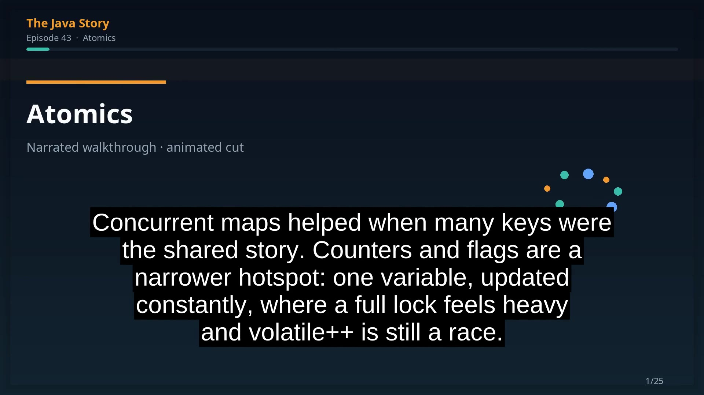

# Episode 43 — Atomics

**Cut:** `v2` · **Series:** The Java Story

## Files

- [`thumbnail.jpg`](thumbnail.jpg) — episode thumbnail
- [`Java_Episode_43_Atomics.mp4`](Java_Episode_43_Atomics.mp4) — clean video
- [`Java_Episode_43_Atomics_CAPTIONED.mp4`](Java_Episode_43_Atomics_CAPTIONED.mp4) — captioned video
- [`Java_Episode_43.srt`](Java_Episode_43.srt) — captions (SRT)
- [`Java_Episode_43_SOURCE.md`](Java_Episode_43_SOURCE.md) — build provenance
- [`narration.md`](narration.md) — narration used for this render

## Navigation

- Previous: [Episode 42 — Concurrent Collections](../ep42-concurrent-collections/)
- Next: [Episode 44 — Synchronizers](../ep44-synchronizers/)
- Index: [`../../INDEX.md`](../../INDEX.md)
