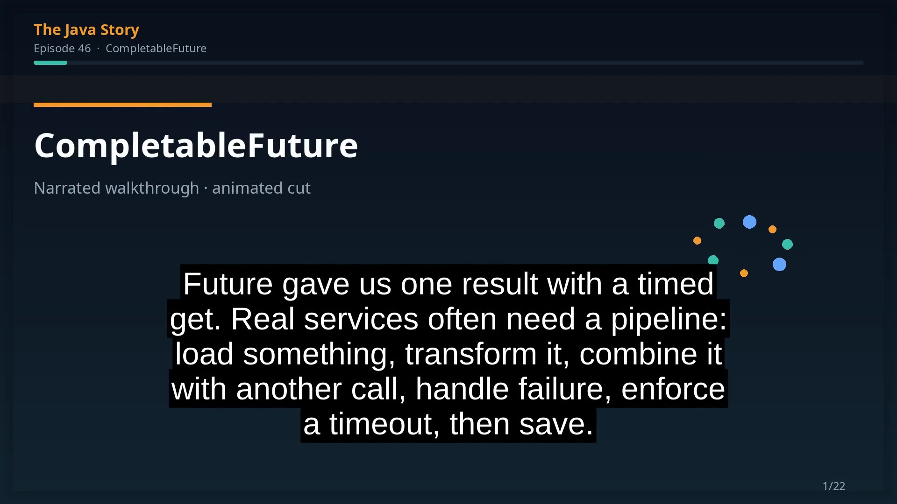

# Episode 46 — CompletableFuture

**Cut:** `v2` · **Series:** The Java Story

## Files

- [`thumbnail.jpg`](thumbnail.jpg) — episode thumbnail
- [`Java_Episode_46_CompletableFuture.mp4`](Java_Episode_46_CompletableFuture.mp4) — clean video
- [`Java_Episode_46_CompletableFuture_CAPTIONED.mp4`](Java_Episode_46_CompletableFuture_CAPTIONED.mp4) — captioned video
- [`Java_Episode_46.srt`](Java_Episode_46.srt) — captions (SRT)
- [`Java_Episode_46_SOURCE.md`](Java_Episode_46_SOURCE.md) — build provenance
- [`narration.md`](narration.md) — narration used for this render

## Navigation

- Previous: [Episode 45 — BlockingQueue](../ep45-blockingqueue/)
- Next: [Episode 47 — ForkJoinPool](../ep47-forkjoinpool/)
- Index: [`../../INDEX.md`](../../INDEX.md)
