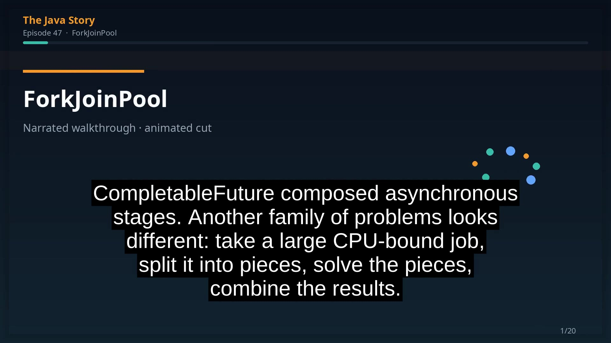

# Episode 47 — ForkJoinPool

**Cut:** `v2` · **Series:** The Java Story

## Files

- [`thumbnail.jpg`](thumbnail.jpg) — episode thumbnail
- [`Java_Episode_47_ForkJoinPool.mp4`](Java_Episode_47_ForkJoinPool.mp4) — clean video
- [`Java_Episode_47_ForkJoinPool_CAPTIONED.mp4`](Java_Episode_47_ForkJoinPool_CAPTIONED.mp4) — captioned video
- [`Java_Episode_47.srt`](Java_Episode_47.srt) — captions (SRT)
- [`Java_Episode_47_SOURCE.md`](Java_Episode_47_SOURCE.md) — build provenance
- [`narration.md`](narration.md) — narration used for this render

## Navigation

- Previous: [Episode 46 — CompletableFuture](../ep46-completablefuture/)
- Next: [Episode 48 — ThreadLocal](../ep48-threadlocal/)
- Index: [`../../INDEX.md`](../../INDEX.md)
