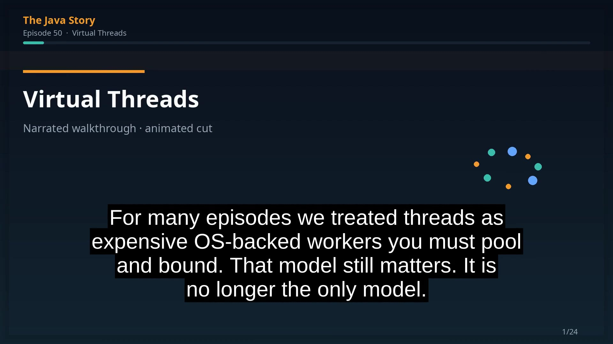

# Episode 50 — Virtual Threads

**Cut:** `v2` · **Series:** The Java Story

## Files

- [`thumbnail.jpg`](thumbnail.jpg) — episode thumbnail
- [`Java_Episode_50_Virtual_Threads.mp4`](Java_Episode_50_Virtual_Threads.mp4) — clean video
- [`Java_Episode_50_Virtual_Threads_CAPTIONED.mp4`](Java_Episode_50_Virtual_Threads_CAPTIONED.mp4) — captioned video
- [`Java_Episode_50.srt`](Java_Episode_50.srt) — captions (SRT)
- [`Java_Episode_50_SOURCE.md`](Java_Episode_50_SOURCE.md) — build provenance
- [`narration.md`](narration.md) — narration used for this render

## Navigation

- Previous: [Episode 49 — Deadlocks](../ep49-deadlocks/)
- Next: [Episode 51 — Class Loading](../ep51-class-loading/)
- Index: [`../../INDEX.md`](../../INDEX.md)
