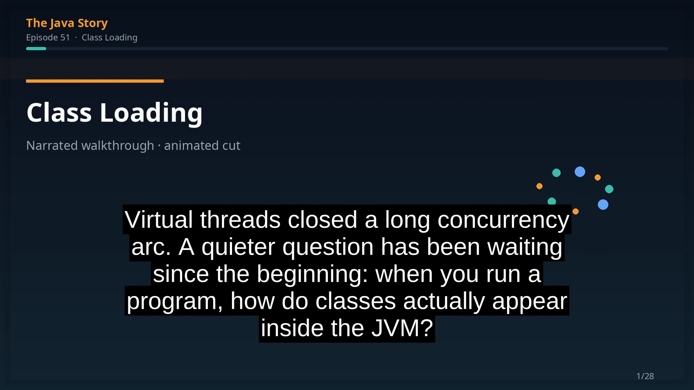

# Episode 51 — Class Loading

**Cut:** `v2` · **Series:** The Java Story

## Files

- [`thumbnail.jpg`](thumbnail.jpg) — episode thumbnail
- [`Java_Episode_51_Class_Loading.mp4`](Java_Episode_51_Class_Loading.mp4) — clean video
- [`Java_Episode_51_Class_Loading_CAPTIONED.mp4`](Java_Episode_51_Class_Loading_CAPTIONED.mp4) — captioned video
- [`Java_Episode_51.srt`](Java_Episode_51.srt) — captions (SRT)
- [`Java_Episode_51_SOURCE.md`](Java_Episode_51_SOURCE.md) — build provenance
- [`narration.md`](narration.md) — narration used for this render

## Navigation

- Previous: [Episode 50 — Virtual Threads](../ep50-virtual-threads/)
- Next: [Episode 52 — Bytecode Basics](../ep52-bytecode-basics/)
- Index: [`../../INDEX.md`](../../INDEX.md)
