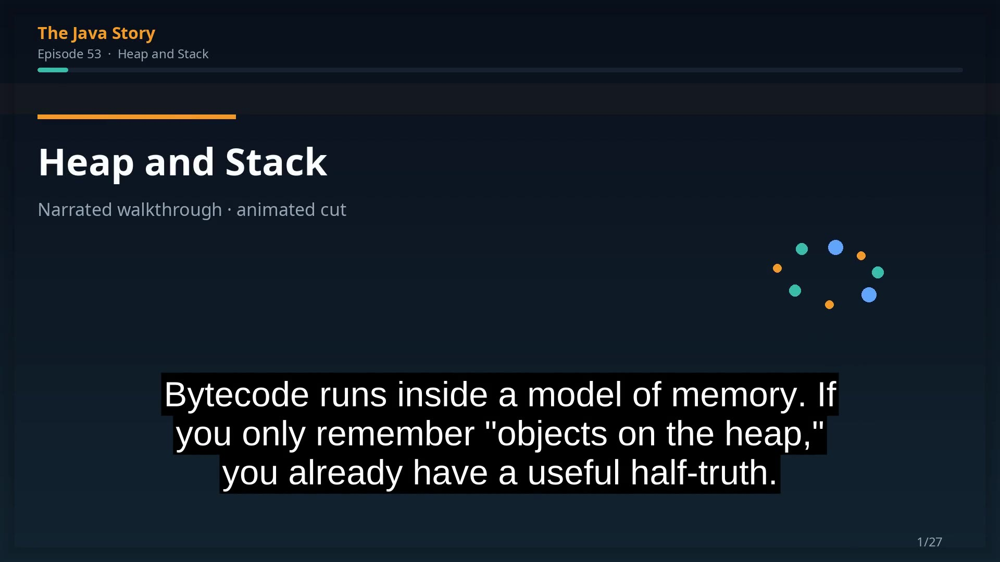

# Episode 53 — Heap and Stack

**Cut:** `v2` · **Series:** The Java Story

## Files

- [`thumbnail.jpg`](thumbnail.jpg) — episode thumbnail
- [`Java_Episode_53_Heap_and_Stack.mp4`](Java_Episode_53_Heap_and_Stack.mp4) — clean video
- [`Java_Episode_53_Heap_and_Stack_CAPTIONED.mp4`](Java_Episode_53_Heap_and_Stack_CAPTIONED.mp4) — captioned video
- [`Java_Episode_53.srt`](Java_Episode_53.srt) — captions (SRT)
- [`Java_Episode_53_SOURCE.md`](Java_Episode_53_SOURCE.md) — build provenance
- [`narration.md`](narration.md) — narration used for this render

## Navigation

- Previous: [Episode 52 — Bytecode Basics](../ep52-bytecode-basics/)
- Next: [Episode 54 — Garbage Collection](../ep54-garbage-collection/)
- Index: [`../../INDEX.md`](../../INDEX.md)
