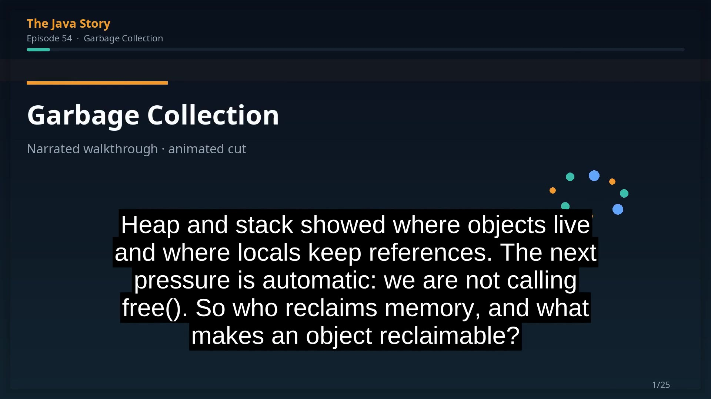

# Episode 54 — Garbage Collection

**Cut:** `v2` · **Series:** The Java Story

## Files

- [`thumbnail.jpg`](thumbnail.jpg) — episode thumbnail
- [`Java_Episode_54_Garbage_Collection.mp4`](Java_Episode_54_Garbage_Collection.mp4) — clean video
- [`Java_Episode_54_Garbage_Collection_CAPTIONED.mp4`](Java_Episode_54_Garbage_Collection_CAPTIONED.mp4) — captioned video
- [`Java_Episode_54.srt`](Java_Episode_54.srt) — captions (SRT)
- [`Java_Episode_54_SOURCE.md`](Java_Episode_54_SOURCE.md) — build provenance
- [`narration.md`](narration.md) — narration used for this render

## Navigation

- Previous: [Episode 53 — Heap and Stack](../ep53-heap-and-stack/)
- Next: [Episode 55 — JIT Compilation](../ep55-jit-compilation/)
- Index: [`../../INDEX.md`](../../INDEX.md)
