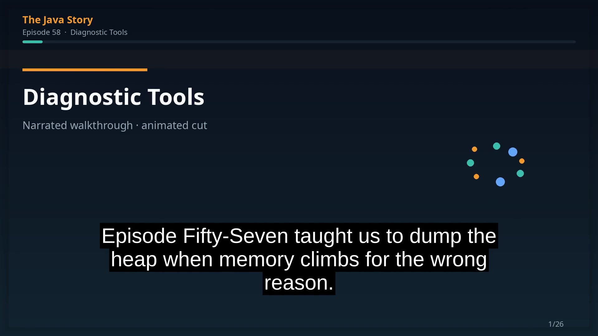

# Episode 58 — Diagnostic Tools

**Cut:** `v2` · **Series:** The Java Story

## Files

- [`thumbnail.jpg`](thumbnail.jpg) — episode thumbnail
- [`Java_Episode_58_Diagnostic_Tools.mp4`](Java_Episode_58_Diagnostic_Tools.mp4) — clean video
- [`Java_Episode_58_Diagnostic_Tools_CAPTIONED.mp4`](Java_Episode_58_Diagnostic_Tools_CAPTIONED.mp4) — captioned video
- [`Java_Episode_58.srt`](Java_Episode_58.srt) — captions (SRT)
- [`Java_Episode_58_SOURCE.md`](Java_Episode_58_SOURCE.md) — build provenance
- [`narration.md`](narration.md) — narration used for this render

## Navigation

- Previous: [Episode 57 — Memory Leaks and Profiling](../ep57-memory-leaks-and-profiling/)
- Next: [Episode 59 — Escape Analysis](../ep59-escape-analysis/)
- Index: [`../../INDEX.md`](../../INDEX.md)
