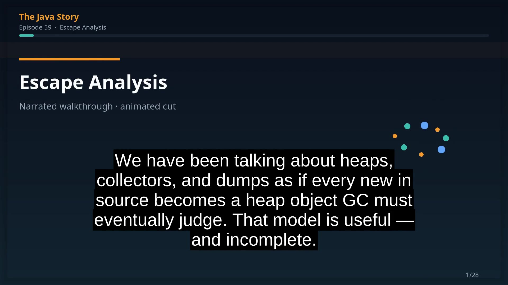

# Episode 59 — Escape Analysis

**Cut:** `v2` · **Series:** The Java Story

## Files

- [`thumbnail.jpg`](thumbnail.jpg) — episode thumbnail
- [`Java_Episode_59_Escape_Analysis.mp4`](Java_Episode_59_Escape_Analysis.mp4) — clean video
- [`Java_Episode_59_Escape_Analysis_CAPTIONED.mp4`](Java_Episode_59_Escape_Analysis_CAPTIONED.mp4) — captioned video
- [`Java_Episode_59.srt`](Java_Episode_59.srt) — captions (SRT)
- [`Java_Episode_59_SOURCE.md`](Java_Episode_59_SOURCE.md) — build provenance
- [`narration.md`](narration.md) — narration used for this render

## Navigation

- Previous: [Episode 58 — Diagnostic Tools](../ep58-diagnostic-tools/)
- Next: [Episode 60 — Metaspace and Native Memory](../ep60-metaspace-and-native-memory/)
- Index: [`../../INDEX.md`](../../INDEX.md)
