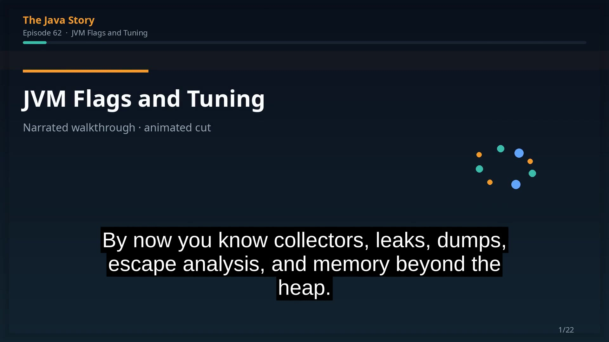

# Episode 62 — JVM Flags and Tuning

**Cut:** `v2` · **Series:** The Java Story

## Files

- [`thumbnail.jpg`](thumbnail.jpg) — episode thumbnail
- [`Java_Episode_62_JVM_Flags_and_Tuning.mp4`](Java_Episode_62_JVM_Flags_and_Tuning.mp4) — clean video
- [`Java_Episode_62_JVM_Flags_and_Tuning_CAPTIONED.mp4`](Java_Episode_62_JVM_Flags_and_Tuning_CAPTIONED.mp4) — captioned video
- [`Java_Episode_62.srt`](Java_Episode_62.srt) — captions (SRT)
- [`Java_Episode_62_SOURCE.md`](Java_Episode_62_SOURCE.md) — build provenance
- [`narration.md`](narration.md) — narration used for this render

## Navigation

- Previous: [Episode 61 — Reference Types](../ep61-reference-types/)
- Next: [Episode 63 — Object Layout](../ep63-object-layout/)
- Index: [`../../INDEX.md`](../../INDEX.md)
