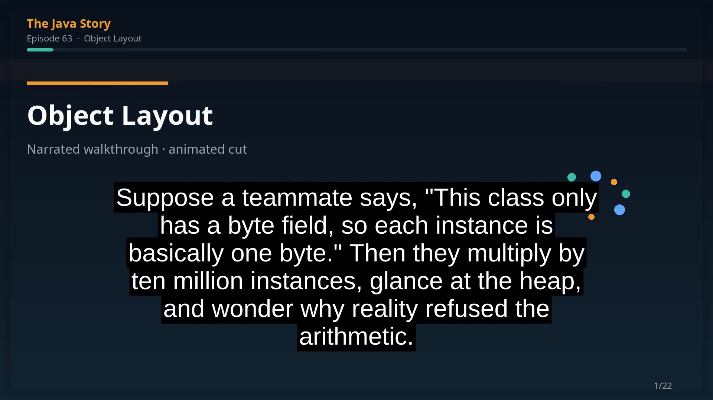

# Episode 63 — Object Layout

**Cut:** `v2` · **Series:** The Java Story

## Files

- [`thumbnail.jpg`](thumbnail.jpg) — episode thumbnail
- [`Java_Episode_63_Object_Layout.mp4`](Java_Episode_63_Object_Layout.mp4) — clean video
- [`Java_Episode_63_Object_Layout_CAPTIONED.mp4`](Java_Episode_63_Object_Layout_CAPTIONED.mp4) — captioned video
- [`Java_Episode_63.srt`](Java_Episode_63.srt) — captions (SRT)
- [`Java_Episode_63_SOURCE.md`](Java_Episode_63_SOURCE.md) — build provenance
- [`narration.md`](narration.md) — narration used for this render

## Navigation

- Previous: [Episode 62 — JVM Flags and Tuning](../ep62-jvm-flags-and-tuning/)
- Next: [Episode 64 — Safepoints](../ep64-safepoints/)
- Index: [`../../INDEX.md`](../../INDEX.md)
