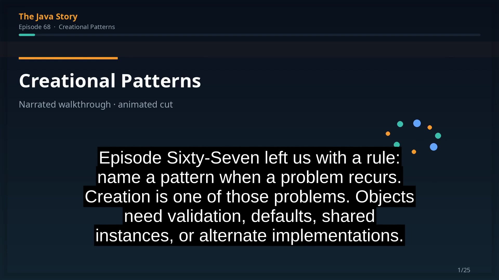

# Episode 68 — Creational Patterns

**Cut:** `v2` · **Series:** The Java Story

## Files

- [`thumbnail.jpg`](thumbnail.jpg) — episode thumbnail
- [`Java_Episode_68_Creational_Patterns.mp4`](Java_Episode_68_Creational_Patterns.mp4) — clean video
- [`Java_Episode_68_Creational_Patterns_CAPTIONED.mp4`](Java_Episode_68_Creational_Patterns_CAPTIONED.mp4) — captioned video
- [`Java_Episode_68.srt`](Java_Episode_68.srt) — captions (SRT)
- [`Java_Episode_68_SOURCE.md`](Java_Episode_68_SOURCE.md) — build provenance
- [`narration.md`](narration.md) — narration used for this render

## Navigation

- Previous: [Episode 67 — Design Patterns Intro](../ep67-design-patterns-intro/)
- Next: [Episode 69 — Structural Patterns](../ep69-structural-patterns/)
- Index: [`../../INDEX.md`](../../INDEX.md)
