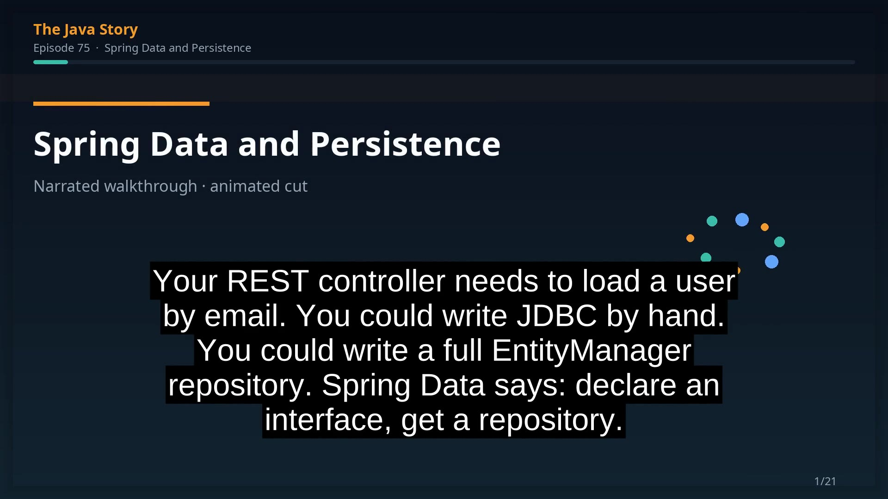

# Episode 75 — Spring Data and Persistence

**Cut:** `v2` · **Series:** The Java Story

## Files

- [`thumbnail.jpg`](thumbnail.jpg) — episode thumbnail
- [`Java_Episode_75_Spring_Data_and_Persistence.mp4`](Java_Episode_75_Spring_Data_and_Persistence.mp4) — clean video
- [`Java_Episode_75_Spring_Data_and_Persistence_CAPTIONED.mp4`](Java_Episode_75_Spring_Data_and_Persistence_CAPTIONED.mp4) — captioned video
- [`Java_Episode_75.srt`](Java_Episode_75.srt) — captions (SRT)
- [`Java_Episode_75_SOURCE.md`](Java_Episode_75_SOURCE.md) — build provenance
- [`narration.md`](narration.md) — narration used for this render

## Navigation

- Previous: [Episode 74 — Spring MVC and REST](../ep74-spring-mvc-and-rest/)
- Next: [Episode 76 — Spring Security](../ep76-spring-security/)
- Index: [`../../INDEX.md`](../../INDEX.md)
