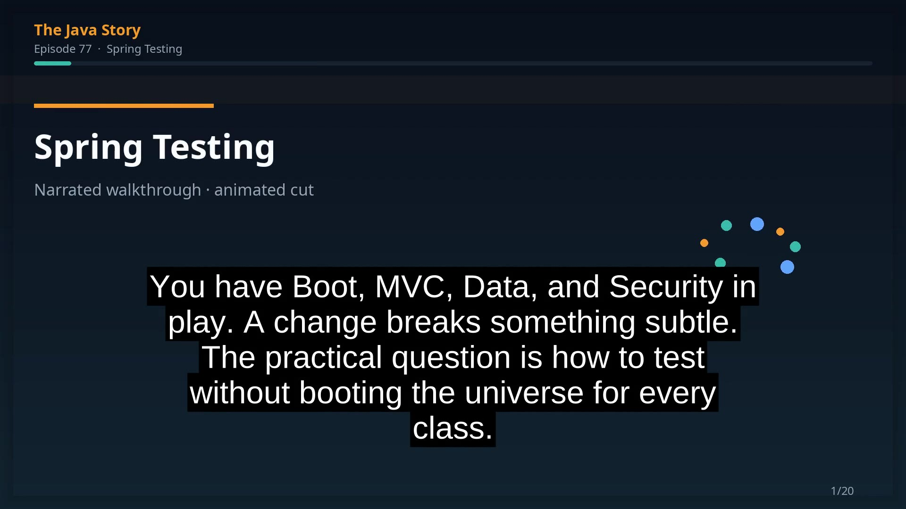

# Episode 77 — Spring Testing

**Cut:** `v2` · **Series:** The Java Story

## Files

- [`thumbnail.jpg`](thumbnail.jpg) — episode thumbnail
- [`Java_Episode_77_Spring_Testing.mp4`](Java_Episode_77_Spring_Testing.mp4) — clean video
- [`Java_Episode_77_Spring_Testing_CAPTIONED.mp4`](Java_Episode_77_Spring_Testing_CAPTIONED.mp4) — captioned video
- [`Java_Episode_77.srt`](Java_Episode_77.srt) — captions (SRT)
- [`Java_Episode_77_SOURCE.md`](Java_Episode_77_SOURCE.md) — build provenance
- [`narration.md`](narration.md) — narration used for this render

## Navigation

- Previous: [Episode 76 — Spring Security](../ep76-spring-security/)
- Next: [Episode 78 — Microservices Basics](../ep78-microservices-basics/)
- Index: [`../../INDEX.md`](../../INDEX.md)
