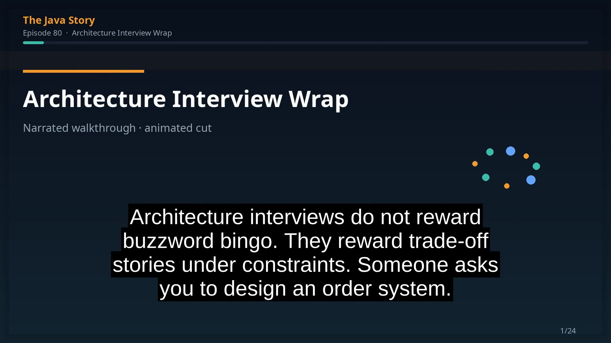

# Episode 80 — Architecture Interview Wrap

**Cut:** `v2` · **Series:** The Java Story

## Files

- [`thumbnail.jpg`](thumbnail.jpg) — episode thumbnail
- [`Java_Episode_80_Architecture_Interview_Wrap.mp4`](Java_Episode_80_Architecture_Interview_Wrap.mp4) — clean video
- [`Java_Episode_80_Architecture_Interview_Wrap_CAPTIONED.mp4`](Java_Episode_80_Architecture_Interview_Wrap_CAPTIONED.mp4) — captioned video
- [`Java_Episode_80.srt`](Java_Episode_80.srt) — captions (SRT)
- [`Java_Episode_80_SOURCE.md`](Java_Episode_80_SOURCE.md) — build provenance
- [`narration.md`](narration.md) — narration used for this render

## Navigation

- Previous: [Episode 79 — Observability and Resilience](../ep79-observability-and-resilience/)
- Next: [Episode 81 — Caching Strategies](../ep81-caching-strategies/)
- Index: [`../../INDEX.md`](../../INDEX.md)
