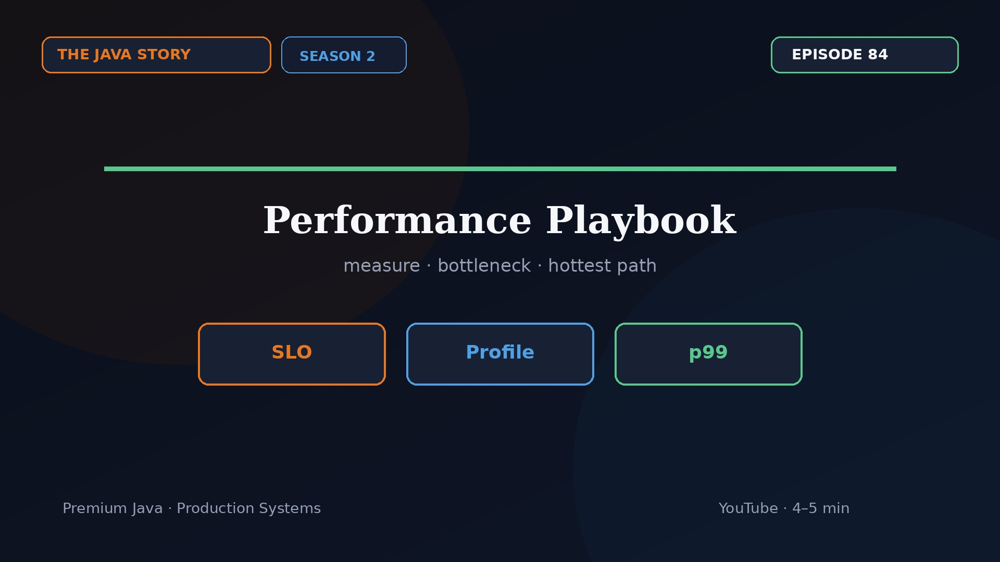

# Episode 84 — Performance Playbook

**Cut:** `v2` · **Series:** The Java Story

## Files

- [`thumbnail.jpg`](thumbnail.jpg) — episode thumbnail
- [`Java_Episode_84_Performance_Playbook.mp4`](Java_Episode_84_Performance_Playbook.mp4) — clean video
- [`Java_Episode_84_Performance_Playbook_CAPTIONED.mp4`](Java_Episode_84_Performance_Playbook_CAPTIONED.mp4) — captioned video
- [`Java_Episode_84.srt`](Java_Episode_84.srt) — captions (SRT)
- [`Java_Episode_84_SOURCE.md`](Java_Episode_84_SOURCE.md) — build provenance
- [`narration.md`](narration.md) — narration used for this render

## Navigation

- Previous: [Episode 83 — Event-Driven Architecture](../ep83-event-driven-architecture/)
- Next: [Episode 85 — Production Readiness Capstone](../ep85-production-readiness-capstone/)
- Index: [`../../INDEX.md`](../../INDEX.md)
