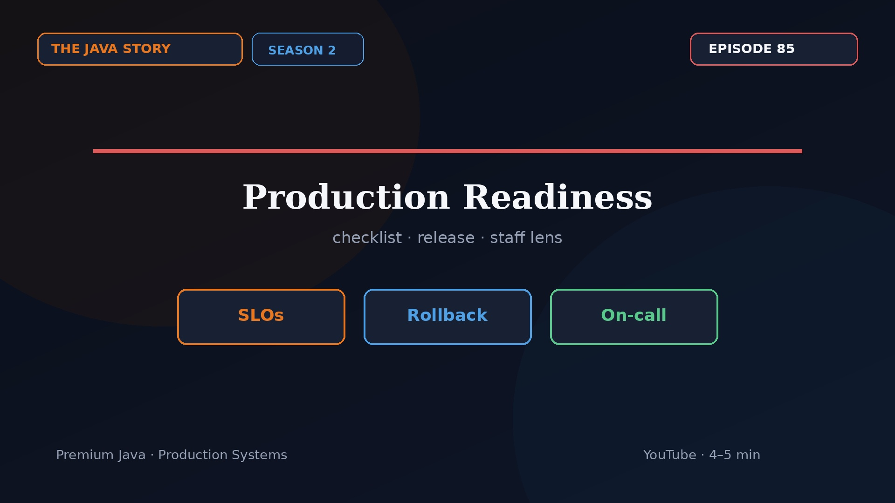

# Episode 85 — Production Readiness Capstone

**Cut:** `v2` · **Series:** The Java Story

## Files

- [`thumbnail.jpg`](thumbnail.jpg) — episode thumbnail
- [`Java_Episode_85_Production_Readiness_Capstone.mp4`](Java_Episode_85_Production_Readiness_Capstone.mp4) — clean video
- [`Java_Episode_85_Production_Readiness_Capstone_CAPTIONED.mp4`](Java_Episode_85_Production_Readiness_Capstone_CAPTIONED.mp4) — captioned video
- [`Java_Episode_85.srt`](Java_Episode_85.srt) — captions (SRT)
- [`Java_Episode_85_SOURCE.md`](Java_Episode_85_SOURCE.md) — build provenance
- [`narration.md`](narration.md) — narration used for this render

## Navigation

- Previous: [Episode 84 — Performance Playbook](../ep84-performance-playbook/)
- Index: [`../../INDEX.md`](../../INDEX.md)
