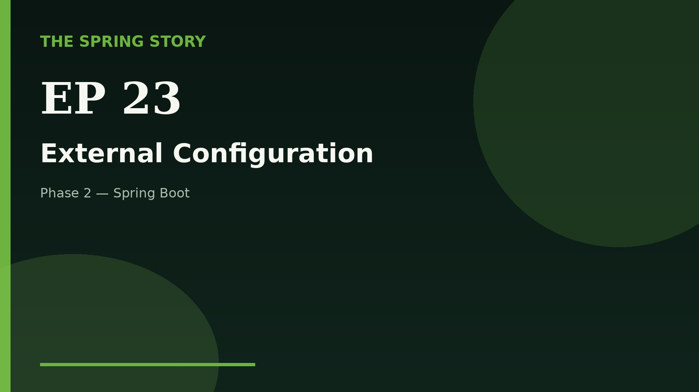

# Episode 23 — External Configuration

**Series:** The Spring Story · **YouTube upload pack**

## YouTube upload checklist

| Asset | File |
|---|---|
| Title | [`title.txt`](title.txt) |
| Description + timestamps | [`youtube_description.txt`](youtube_description.txt) |
| Tags | [`tags.txt`](tags.txt) |
| Thumbnail | [`thumbnail.jpg`](thumbnail.jpg) |
| Chapters | [`chapters.txt`](chapters.txt) |
| Narration / transcript | [`narration.md`](narration.md) |

> Video (`.mp4`) and captions (`.srt`) are produced in a later video-build pass. Upload metadata and thumbnail are ready now.

## Suggested upload

1. Upload the episode video when available (clean preferred; captioned optional).
2. Set title from `title.txt`.
3. Paste `youtube_description.txt` into the YouTube description.
4. Upload `thumbnail.jpg` (branded still — not a video frame; no burned-in subtitles).
5. Add tags from `tags.txt`.
6. Upload `.srt` captions when available.

## Navigation

- Previous: see INDEX.md
- Next: [ep24-actuator](../ep24-actuator/)
- Index: [`../../INDEX.md`](../../INDEX.md)
